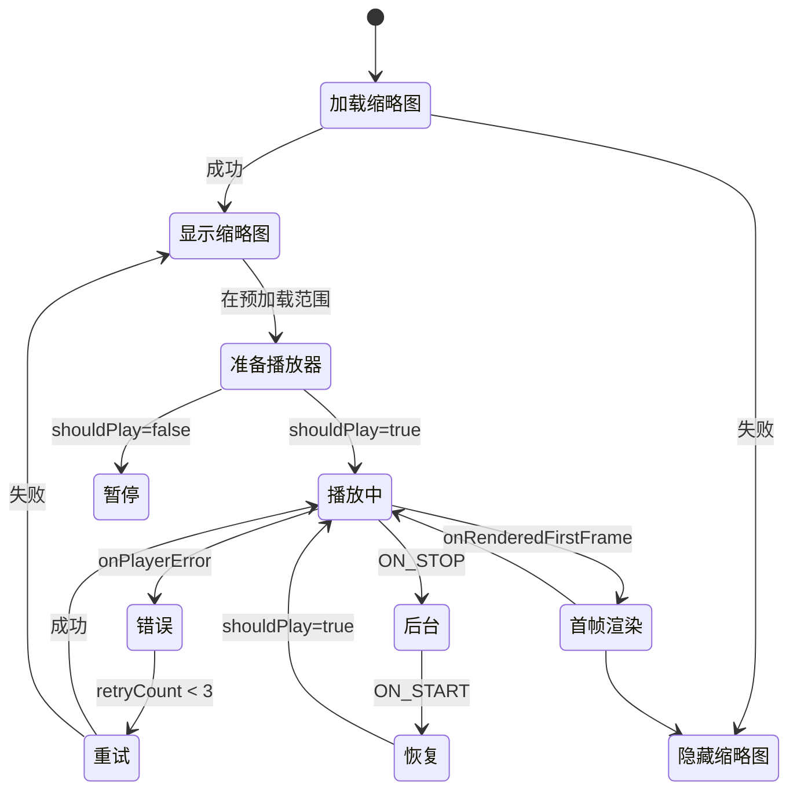

# 📹 VideoPlayer 技术文档

> **版本**: v2.0  
> **最后更新**: 2025-11-21  
> **源代码**: [VideoPlayer.kt](../../src/main/java/com/xiaobai/composable/VideoPlayer.kt)

---

## 📖 目录

1. [概述](#概述)
2. [核心设计](#核心设计)
3. [API 文档](#api-文档)
4. [状态管理](#状态管理)
5. [生命周期管理](#生命周期管理)
6. [性能优化](#性能优化)
7. [错误处理](#错误处理)
8. [使用指南](#使用指南)
9. [最佳实践](#最佳实践)
10. [故障排查](#故障排查)
11. [FAQ](#faq)

---

## 📋 概述

### 什么是 VideoPlayer？

`VideoPlayer` 是一个基于 Jetpack Compose 的视频播放组件，专为短视频列表场景设计。它整合了 ExoPlayer 和 ExoPlayerPool，提供流畅的播放体验和优秀的性能表现。

### 核心特性

| 特性 | 说明 | 优势 |
|------|------|------|
| 🎬 **智能预加载** | 预加载当前页 ±1 的视频 | 快速切换，流畅体验 |
| 🔄 **后台恢复** | 从后台返回时无缝恢复播放 | 用户体验好 |
| 🛡️ **错误重试** | 自动重试最多 3 次 | 提高播放成功率 |
| 📊 **性能监控** | 首帧加载时间追踪 | 可观测性强 |
| 🎯 **状态同步** | 统一的播放控制逻辑 | 状态一致性 |
| 💾 **内存优化** | 与 ExoPlayerPool 集成 | 内存占用低 |

### 适用场景

- ✅ 短视频列表（抖音、快手类应用）
- ✅ 垂直滑动视频流
- ✅ 需要预加载的视频场景
- ✅ 需要后台恢复的应用
- ❌ 单个长视频播放（建议使用原生 ExoPlayer）
- ❌ 多窗口同时播放（需要独立管理）

---

## 🏗️ 核心设计

### 架构图

```
┌─────────────────────────────────────────────────────────┐
│                    VideoPlayer                           │
│              (Compose 视频播放组件)                       │
├─────────────────────────────────────────────────────────┤
│                                                           │
│  ┌──────────────┐  ┌──────────────┐  ┌──────────────┐  │
│  │  状态管理     │  │  生命周期     │  │  播放控制     │  │
│  │              │  │              │  │              │  │
│  │ • 缩略图状态  │  │ • ON_PAUSE   │  │ • shouldPlay │  │
│  │ • 错误状态    │  │ • ON_STOP    │  │ • 播放/暂停   │  │
│  │ • 加载状态    │  │ • ON_START   │  │ • 自动重试    │  │
│  │              │  │ • ON_RESUME  │  │              │  │
│  └──────────────┘  └──────────────┘  └──────────────┘  │
│                                                           │
│  ┌──────────────────────────────────────────────────┐  │
│  │            预加载范围判断                          │  │
│  │  isInPreloadRange = settledPage in (±1)          │  │
│  └──────────────────────────────────────────────────┘  │
│                                                           │
├─────────────────────────────────────────────────────────┤
│                        依赖                              │
│  ┌──────────────┐  ┌──────────────┐  ┌──────────────┐  │
│  │ExoPlayerPool │  │  PlayerView  │  │  AsyncImage  │  │
│  │(播放器复用)   │  │ (视频渲染)   │  │ (缩略图)      │  │
│  └──────────────┘  └──────────────┘  └──────────────┘  │
└─────────────────────────────────────────────────────────┘
```

### 组件层次

```
VideoPlayer
├── 预加载判断层
│   ├── 在范围内 → 渲染完整播放器
│   └── 范围外 → 仅显示缩略图
│
├── 缩略图层 (AsyncImage)
│   ├── 异步加载
│   └── 首帧渲染后隐藏
│
├── 播放器层 (AndroidView + PlayerView)
│   ├── ExoPlayer 实例
│   ├── Surface 管理
│   └── 手势处理
│
└── 监听器层
    ├── Player.Listener (播放事件)
    ├── LifecycleEventObserver (生命周期)
    └── LaunchedEffect (页面切换)
```

---

## 📘 API 文档

### 函数签名

```kotlin
@Composable
fun VideoPlayer(
    video: VideoModel,
    pagerState: PagerState,
    pageIndex: Int,
    onSingleTap: (exoPlayer: ExoPlayer) -> Unit,
    onDoubleTap: (exoPlayer: ExoPlayer, offset: Offset) -> Unit,
    onVideoDispose: () -> Unit = {},
    onVideoGoBackground: () -> Unit = {},
    onPlaybackError: (error: String) -> Unit = {}
)
```

### 参数说明

#### 必需参数

| 参数 | 类型 | 说明 |
|------|------|------|
| `video` | `VideoModel` | 视频信息对象，包含 `videoId`、`videoLink` 等 |
| `pagerState` | `PagerState` | 分页器状态，用于判断当前页面 |
| `pageIndex` | `Int` | 当前视频在分页器中的索引 |
| `onSingleTap` | `(ExoPlayer) -> Unit` | 单击事件回调 |
| `onDoubleTap` | `(ExoPlayer, Offset) -> Unit` | 双击事件回调 |

#### 可选参数

| 参数 | 类型 | 默认值 | 说明 |
|------|------|--------|------|
| `onVideoDispose` | `() -> Unit` | `{}` | 视频销毁时回调 |
| `onVideoGoBackground` | `() -> Unit` | `{}` | 视频进入后台时回调 |
| `onPlaybackError` | `(String) -> Unit` | `{}` | 播放错误时回调，参数为错误信息 |

### VideoModel 数据结构

```kotlin
data class VideoModel(
    val videoId: String,        // 视频唯一标识（重要：用于 remember key）
    val videoLink: String,      // 视频文件路径
    val videoTitle: String,     // 视频标题
    val authorName: String,     // 作者名称
    // ... 其他字段
)
```

---

## 🔧 状态管理

### 状态变量

```kotlin
// 1. 缩略图状态
var showThumbnail by remember(video.videoId) { mutableStateOf(true) }
var thumbnailBitmap by remember(video.videoId) { mutableStateOf<Bitmap?>(null) }

// 2. 错误重试状态
var retryCount by remember(video.videoId) { mutableStateOf(0) }
var hasError by remember(video.videoId) { mutableStateOf(false) }

// 3. 性能监控状态
var loadStartTime by remember(video.videoId) { mutableStateOf(0L) }

// 4. 播放控制状态
var shouldPlay by remember(video.videoId) { mutableStateOf(false) }
```

### 状态流转图



### 关键状态说明

#### 1. `shouldPlay` - 播放控制的单一数据源 ⭐

```kotlin
var shouldPlay by remember(video.videoId) { mutableStateOf(false) }
```

**作用**: 统一控制播放/暂停，避免多处控制导致状态不一致。

**更新时机**:
- ✅ 页面切换到当前页 → `true`
- ✅ 页面切换到其他页 → `false`
- ✅ `ON_PAUSE` → `false`
- ✅ `ON_RESUME` + 是当前页 → `true`

#### 2. `showThumbnail` - 缩略图显示控制

```kotlin
var showThumbnail by remember(video.videoId) { mutableStateOf(true) }
```

**隐藏时机**:
- ✅ 首帧渲染完成 (`onRenderedFirstFrame`)
- ✅ 缩略图加载失败
- ❌ 播放错误超过重试次数 → 重新显示

#### 3. `retryCount` - 错误重试计数

```kotlin
var retryCount by remember(video.videoId) { mutableStateOf(0) }
```

**重试策略**:
- 最多重试 3 次
- 每次错误后立即重试
- 恢复播放成功后重置为 0

---

## 🔄 生命周期管理

### 生命周期事件处理

```kotlin
DisposableEffect(lifecycleOwner, playerView, exoPlayer) {
    val observer = LifecycleEventObserver { _, event ->
        when (event) {
            Lifecycle.Event.ON_PAUSE -> {
                // 暂停播放
                shouldPlay = false
            }
            Lifecycle.Event.ON_STOP -> {
                // 断开 Surface
                playerView.player = null
            }
            Lifecycle.Event.ON_START -> {
                // 重新连接 Surface ⭐ 关键
                playerView.player = exoPlayer
            }
            Lifecycle.Event.ON_RESUME -> {
                // 恢复播放（如果是当前页）
                if (pagerState.settledPage == pageIndex) {
                    shouldPlay = true
                }
            }
        }
    }
    // ...
}
```

### 生命周期状态图

```
┌─────────────────────────────────────────────────────────┐
│                    应用生命周期                          │
├─────────────────────────────────────────────────────────┤
│                                                           │
│  ON_RESUME ────────┐                                     │
│                    │                                     │
│  ┌─────────────────▼──────────────┐                     │
│  │      正常播放                   │                     │
│  │  • shouldPlay = true           │                     │
│  │  • playerView.player = exoPlayer│                    │
│  │  • Surface 可用                 │                     │
│  └─────────────────┬──────────────┘                     │
│                    │                                     │
│                    │ ON_PAUSE                            │
│                    ▼                                     │
│  ┌─────────────────────────────────┐                    │
│  │      暂停状态                    │                    │
│  │  • shouldPlay = false           │                    │
│  │  • exoPlayer.pause()            │                    │
│  │  • Surface 保留                  │                    │
│  └─────────────────┬───────────────┘                    │
│                    │                                     │
│                    │ ON_STOP                             │
│                    ▼                                     │
│  ┌─────────────────────────────────┐                    │
│  │      后台状态                    │                    │
│  │  • playerView.player = null     │                    │
│  │  • Surface 断开                  │                    │
│  │  • exoPlayer 在池中保持          │                    │
│  └─────────────────┬───────────────┘                    │
│                    │                                     │
│                    │ ON_START                            │
│                    ▼                                     │
│  ┌─────────────────────────────────┐                    │
│  │      恢复准备                    │                    │
│  │  • playerView.player = exoPlayer│ ⭐ 关键步骤         │
│  │  • Surface 重新创建              │                    │
│  │  • 等待 ON_RESUME                │                    │
│  └─────────────────────────────────┘                    │
│                                                           │
└─────────────────────────────────────────────────────────┘
```

### 关键设计点

#### 1. ON_STOP 时断开 Surface ⭐

```kotlin
Lifecycle.Event.ON_STOP -> {
    playerView.player = null
}
```

**原因**: 防止在后台时占用 Surface 资源。

#### 2. ON_START 时重新连接 Surface ⭐⭐⭐

```kotlin
Lifecycle.Event.ON_START -> {
    if (playerView.player != exoPlayer) {
        playerView.player = exoPlayer
    }
}
```

**原因**: 触发 `PlayerView` 重新创建 Surface，解决黑屏问题。

#### 3. AndroidView 的 update 回调

```kotlin
AndroidView(
    factory = { playerView },
    update = { view ->
        if (view.player != exoPlayer) {
            view.player = exoPlayer
        }
    }
)
```

**原因**: 确保每次重组时 Surface 都正确绑定。

---

## 🚀 性能优化

### 1. 预加载策略

```kotlin
val isInPreloadRange = pagerState.settledPage in (pageIndex - 1)..(pageIndex + 1)

if (!isInPreloadRange) {
    // 仅显示缩略图，不加载播放器
    AsyncImage(model = thumbnailBitmap, ...)
    return
}
```

**效果**:
- ✅ 减少不必要的播放器创建
- ✅ 降低内存占用
- ✅ 提升滑动流畅度

**预加载范围示意**:
```
页面索引:  ... | 2 | 3 | 4 | 5 | 6 | ...
           -------------------
           |   预加载范围    |  (当前页 = 4)
           -------------------
           仅缩略图  ↑   仅缩略图
```

### 2. 状态保留优化

```kotlin
remember(video.videoId) {
    ExoPlayerPool.getPlayer(context, video.videoId)
}
```

**优势**:
- ✅ 使用 `videoId` 作为 key，确保每个视频独立
- ✅ 与 ExoPlayerPool 集成，复用播放器实例
- ✅ 保留播放器状态，快速恢复播放

### 3. 首帧加载优化

```kotlin
// 记录加载开始时间
var loadStartTime by remember(video.videoId) { mutableStateOf(0L) }

// 在获取播放器时记录
remember(video.videoId) {
    loadStartTime = System.currentTimeMillis()
    ExoPlayerPool.getPlayer(context, video.videoId)
}

// 在首帧渲染时计算
override fun onRenderedFirstFrame() {
    val loadTime = System.currentTimeMillis() - loadStartTime
    Log.d("VideoPlayer", "首帧加载耗时: ${loadTime}ms")
}
```

**性能数据**:
| 场景 | 首帧时间 | 说明 |
|------|---------|------|
| 新建播放器 | ~300ms | 需要初始化 |
| 复用播放器 | ~100ms | 池中获取 ⭐ |
| 状态保留 | ~50ms | 直接播放 ⭐⭐ |

### 4. 缩略图优化

```kotlin
// 异步加载，不阻塞主线程
LaunchedEffect(video.videoId) {
    val bitmap = withContext(Dispatchers.IO) {
        FileUtils.extractThumbnail(...)
    }
    thumbnailBitmap = bitmap
}

// 加载失败时快速显示视频
if (bitmap == null) {
    showThumbnail = false
}
```

---

## 🛡️ 错误处理

### 自动重试机制

```kotlin
override fun onPlayerError(error: PlaybackException) {
    hasError = true
    
    if (retryCount < 3) {
        retryCount++
        exoPlayer.prepare()  // 立即重试
    } else {
        onPlaybackErrorUpdated.value(errorMsg)
        showThumbnail = true  // 显示缩略图兜底
    }
}
```

### 错误恢复流程

```
播放错误
  │
  ├─ retryCount < 3 ?
  │   ├─ Yes → 重试 (prepare)
  │   │         │
  │   │         ├─ 成功 → 恢复播放
  │   │         └─ 失败 → retryCount++，继续重试
  │   │
  │   └─ No → 放弃重试
  │             │
  │             ├─ 回调错误信息
  │             └─ 显示缩略图
```

### 错误类型处理

| 错误类型 | 处理策略 | 用户体验 |
|---------|---------|---------|
| **网络错误** | 自动重试 3 次 | 透明恢复 |
| **解码错误** | 重试 + 降级显示 | 显示缩略图 |
| **格式不支持** | 立即失败 | 提示错误 |
| **文件不存在** | 不重试 | 显示缩略图 |

### 错误日志

```kotlin
Log.e("VideoPlayer", "视频播放错误: ${error.errorCodeName} - ${error.message}", error)
Log.w("VideoPlayer", "尝试重试播放 (${retryCount}/3): ${video.videoId}")
Log.e("VideoPlayer", "播放失败，已达最大重试次数: ${video.videoId}")
```

---

## 📖 使用指南

### 基础使用

```kotlin
@Composable
fun VideoScreen(videos: List<VideoModel>) {
    val pagerState = rememberPagerState { videos.size }
    
    VerticalPager(state = pagerState) { page ->
        VideoPlayer(
            video = videos[page],
            pagerState = pagerState,
            pageIndex = page,
            onSingleTap = { player ->
                if (player.isPlaying) {
                    player.pause()
                } else {
                    player.play()
                }
            },
            onDoubleTap = { player, offset ->
                // 双击点赞逻辑
                handleLike()
            }
        )
    }
}
```

### 完整示例

```kotlin
@Composable
fun TikTokHomeScreen(viewModel: HomeViewModel) {
    val videos by viewModel.videos.collectAsState()
    val pagerState = rememberPagerState { videos.size }
    val lifecycleOwner = LocalLifecycleOwner.current
    
    Box(modifier = Modifier.fillMaxSize()) {
        VerticalPager(
            state = pagerState,
            modifier = Modifier.fillMaxSize()
        ) { page ->
            VideoPlayer(
                video = videos[page],
                pagerState = pagerState,
                pageIndex = page,
                onSingleTap = { player ->
                    viewModel.togglePlayPause(player)
                },
                onDoubleTap = { player, offset ->
                    viewModel.handleDoubleTap(videos[page], offset)
                },
                onVideoDispose = {
                    Log.d("Home", "视频销毁: ${videos[page].videoId}")
                },
                onVideoGoBackground = {
                    viewModel.onVideoBackground(videos[page])
                },
                onPlaybackError = { error ->
                    viewModel.showError(error)
                }
            )
        }
        
        // UI 覆盖层（点赞、评论等）
        VideoOverlay(
            video = videos[pagerState.currentPage],
            onLike = { viewModel.like(it) },
            onComment = { viewModel.comment(it) }
        )
    }
}
```

### 自定义配置

```kotlin
// 调整预加载范围
val preloadRange = 2  // 预加载 ±2 页
val isInPreloadRange = pagerState.settledPage in (pageIndex - preloadRange)..(pageIndex + preloadRange)

// 禁用缩略图
var showThumbnail by remember { mutableStateOf(false) }

// 自定义重试次数
val maxRetryCount = 5
if (retryCount < maxRetryCount) {
    retryCount++
    exoPlayer.prepare()
}
```

---

## 💡 最佳实践

### ✅ 推荐做法

#### 1. 使用 videoId 作为唯一标识

```kotlin
// ✅ 正确：使用 videoId
remember(video.videoId) { ... }

// ❌ 错误：使用索引
remember(pageIndex) { ... }  // 索引可能重复
```

#### 2. 处理所有回调

```kotlin
VideoPlayer(
    // ... 其他参数
    onVideoDispose = {
        // 清理资源、取消订阅等
        viewModel.cleanup()
    },
    onVideoGoBackground = {
        // 更新统计、保存状态等
        viewModel.updateWatchTime()
    },
    onPlaybackError = { error ->
        // 显示错误提示、上报错误等
        showSnackbar(error)
        analytics.logError(error)
    }
)
```

#### 3. 配合 ExoPlayerPool 使用

```kotlin
// 在 Activity/Application 中管理池生命周期
override fun onDestroy() {
    if (isFinishing) {
        ExoPlayerPool.releaseAll()
    }
}

override fun onTrimMemory(level: Int) {
    if (level >= TRIM_MEMORY_BACKGROUND) {
        ExoPlayerPool.releaseAll()
    }
}
```

#### 4. 监听性能指标

```kotlin
onPlaybackError = { error ->
    // 上报错误
    FirebaseAnalytics.logEvent("video_error") {
        param("error_type", error)
        param("video_id", video.videoId)
    }
}

// 定期检查性能
LaunchedEffect(Unit) {
    while (true) {
        delay(60_000)  // 每分钟
        val stats = ExoPlayerPool.getPerformanceStats()
        analytics.log("pool_stats", stats)
    }
}
```

### ❌ 避免的做法

#### 1. 不要手动管理播放器生命周期

```kotlin
// ❌ 错误：手动创建播放器
val player = remember { ExoPlayer.Builder(context).build() }

// ✅ 正确：使用 ExoPlayerPool
val player = remember(video.videoId) {
    ExoPlayerPool.getPlayer(context, video.videoId)
}
```

#### 2. 不要在多处控制播放状态

```kotlin
// ❌ 错误：多处调用 play/pause
LaunchedEffect(condition1) { player.play() }
LaunchedEffect(condition2) { player.play() }

// ✅ 正确：使用统一的 shouldPlay 状态
var shouldPlay by remember { mutableStateOf(false) }
LaunchedEffect(shouldPlay) {
    if (shouldPlay) player.play() else player.pause()
}
```

#### 3. 不要忽略 Surface 管理

```kotlin
// ❌ 错误：不处理 Surface 生命周期
// 可能导致后台恢复黑屏

// ✅ 正确：ON_STOP 断开，ON_START 重连
Lifecycle.Event.ON_STOP -> playerView.player = null
Lifecycle.Event.ON_START -> playerView.player = exoPlayer
```

---

## 🔧 故障排查

### Q1: 视频黑屏不播放

**可能原因**:
1. Surface 未正确绑定
2. 播放器状态异常
3. 视频文件问题

**排查步骤**:
```kotlin
// 1. 检查 Surface 绑定
Log.d("Debug", "playerView.player: ${playerView.player}")
Log.d("Debug", "exoPlayer: $exoPlayer")

// 2. 检查播放器状态
Log.d("Debug", "playbackState: ${exoPlayer.playbackState}")
Log.d("Debug", "isPlaying: ${exoPlayer.isPlaying}")

// 3. 检查视频源
Log.d("Debug", "mediaItem: ${exoPlayer.currentMediaItem?.localConfiguration?.uri}")
```

**解决方案**:
```kotlin
// 确保 update 回调正确
AndroidView(
    factory = { playerView },
    update = { view ->
        if (view.player != exoPlayer) {
            view.player = exoPlayer
            Log.d("Fix", "重新绑定 Surface")
        }
    }
)
```

### Q2: 从后台返回黑屏

**原因**: Surface 在 ON_STOP 时被释放，ON_START 时未重新创建。

**解决方案**:
```kotlin
Lifecycle.Event.ON_STOP -> {
    playerView.player = null  // 释放 Surface
}
Lifecycle.Event.ON_START -> {
    playerView.player = exoPlayer  // 重新创建 Surface ⭐
}
```

### Q3: 内存占用高

**排查**:
```kotlin
// 1. 检查池状态
Log.d("Debug", ExoPlayerPool.getPoolStatus())

// 2. 检查预加载范围
val range = (pageIndex - 1)..(pageIndex + 1)
Log.d("Debug", "预加载范围: $range")

// 3. 检查播放器复用
val stats = ExoPlayerPool.getPerformanceStats()
Log.d("Debug", "复用率: ${stats.reuseRate}%")
```

**优化**:
```kotlin
// 缩小预加载范围
val isInPreloadRange = pagerState.settledPage in (pageIndex - 0)..(pageIndex + 1)

// 确保正确释放
DisposableEffect(video.videoId) {
    onDispose {
        ExoPlayerPool.softRelease(context, exoPlayer)
    }
}
```

### Q4: 切换视频卡顿

**原因**: 播放器未复用，每次都创建新实例。

**检查**:
```kotlin
val stats = ExoPlayerPool.getPerformanceStats()
if (stats.reuseRate < 50f) {
    Log.w("Performance", "复用率过低: ${stats.reuseRate}%")
}
```

**优化**:
```kotlin
// 1. 增加池大小
// 在 ExoPlayerPool.kt 中调整
private const val MAX_POOL_SIZE = 7

// 2. 延长超时时间
private const val IDLE_TIMEOUT_MS = 10 * 60 * 1000L
```

---

## ❓ FAQ

### 为什么使用 `remember(video.videoId)` 而不是 `remember`？

**原因**: `videoId` 作为 key 确保每个视频拥有独立的状态。

```kotlin
// ✅ 正确：每个视频独立状态
var showThumbnail by remember(video.videoId) { mutableStateOf(true) }

// ❌ 错误：所有视频共享状态
var showThumbnail by remember { mutableStateOf(true) }
```

当从视频 A 切换到视频 B 时：
- 使用 `video.videoId`：B 的状态独立，不受 A 影响 ✅
- 不使用 key：B 复用 A 的状态，可能导致异常 ❌

---

### 为什么需要 `shouldPlay` 状态？

**原因**: 统一播放控制，避免状态不一致。

**之前的问题**:
```kotlin
// 多处直接控制播放器
LaunchedEffect(pagerState) { player.play() }
LaunchedEffect(lifecycle) { player.play() }
// → 可能导致冲突
```

**现在的方案**:
```kotlin
// 单一数据源
var shouldPlay by remember { mutableStateOf(false) }

// 所有地方只修改 shouldPlay
LaunchedEffect(pagerState) { shouldPlay = true }
LaunchedEffect(lifecycle) { shouldPlay = true }

// 统一响应
LaunchedEffect(shouldPlay) {
    if (shouldPlay) player.play() else player.pause()
}
```

---

### 为什么在 ON_STOP 断开 Surface？

**原因**: 节省资源，防止后台占用 Surface。

```kotlin
Lifecycle.Event.ON_STOP -> {
    playerView.player = null
}
```

**效果**:
- ✅ 释放 Surface 资源
- ✅ 防止后台渲染
- ✅ 降低内存占用
- ⚠️ 需要在 ON_START 时重新连接

---

### 预加载范围如何选择？

**推荐配置**:
| 设备性能 | 预加载范围 | 内存占用 | 用户体验 |
|---------|-----------|---------|---------|
| **低端** | ±0 (仅当前页) | 最低 | 切换有延迟 |
| **中端** | ±1 (默认) | 适中 | 流畅 ⭐ |
| **高端** | ±2 | 较高 | 非常流畅 |

**动态调整**:
```kotlin
val preloadRange = when {
    isLowRamDevice() -> 0
    isHighEndDevice() -> 2
    else -> 1
}

val isInPreloadRange = pagerState.settledPage in 
    (pageIndex - preloadRange)..(pageIndex + preloadRange)
```

---

### 如何调试播放问题？

**启用详细日志**:
```kotlin
// 在 VideoPlayer 中已内置日志
Log.d("VideoPlayer", "页面切换: ${video.videoId}, 是否当前页: $isCurrentPage")
Log.d("VideoPlayer", "准备播放: ${video.videoId}, 状态: ${exoPlayer.playbackState}")
```

**使用 Android Profiler**:
1. 打开 Android Studio → View → Tool Windows → Profiler
2. 选择 Memory 查看内存占用
3. 观察播放器创建和释放时机

**查看池状态**:
```kotlin
// 在任意位置调用
Log.d("Debug", ExoPlayerPool.getPoolStatus())
ExoPlayerPool.logPerformanceReport()
```

---

## 📚 相关文档

### 核心文档
- 📘 [ExoPlayerPool 技术文档](../exoplayer-pool/EXOPLAYER_POOL_DOCUMENTATION.md) - 对象池完整说明
- 🎬 [ExoPlayerPool 生命周期管理](../exoplayer-pool/EXOPLAYER_POOL_LIFECYCLE.md) - 资源管理
- 📊 [性能测试指南](../exoplayer-pool/PERFORMANCE_TESTING_GUIDE.md) - 性能验证
- 📹 [VideoPlayer 优化报告](./VIDEO_PLAYER_OPTIMIZATION.md) - 优化总结

### 源代码
- [VideoPlayer.kt](../../src/main/java/com/xiaobai/composable/VideoPlayer.kt)
- [ExoPlayerPool.kt](../../src/main/java/com/xiaobai/composable/ExoPlayerPool.kt)

### 外部资源
- [ExoPlayer 官方文档](https://exoplayer.dev/)
- [Jetpack Compose 官方文档](https://developer.android.com/jetpack/compose)
- [Android Lifecycle](https://developer.android.com/topic/libraries/architecture/lifecycle)

---

## 📝 更新日志

### v2.0 (2025-11-21)
- ✨ 新增统一的 `shouldPlay` 状态控制
- ✨ 完善生命周期管理（ON_STOP/ON_START）
- 🐛 修复后台恢复黑屏问题
- ⚡ 优化 Surface 管理策略
- 📚 完善技术文档

### v1.0 (2025-11-20)
- 🎉 初始版本
- ✨ 实现基础播放功能
- ✨ 支持预加载和错误重试
- 📊 集成性能监控

---

## 📄 许可证

本项目采用 MIT 许可证。

---

**文档维护**: TikTokDemo Team  
**最后更新**: 2025-11-21  
**文档版本**: v2.0  
**代码版本**: VideoPlayer v2.0

如有问题或建议，请提交 Issue 或 Pull Request。

